<div align="center">


<h1>FedRAMP Authorization Compliance Platform (ACP)</h1>

<p><strong>The Global Standard for Industrialized Public Sector Compliance and NIST-Aligned Governance</strong></p>

[]()
[]()
[]()
[]()

<br/>

> **"Industrializing federal compliance to automate authorization lifecycles, govern risk, and accelerate digital transformation for the public sector."** 
> FedRAMP Authorization Compliance Platform (FACP) is a flagship repository designed to enable agencies and contractors to design, deploy, and govern secure environments through automated controls, institutional frameworks, and NIST-aligned reference architectures.

</div>

---

## 🏛️ Executive Summary

**FedRAMP Authorization Compliance Platform (ACP)** is a flagship repository designed for CIOs, CISOs, and Compliance Leaders. As government agencies and regulated enterprises migrate mission-critical workloads to the cloud, the ability to automate, monitor, and continuously prove compliance against the FedRAMP / NIST 800-53 framework becomes the critical foundation for security and trust.

This platform provides an industrialized approach to **FedRAMP Governance**, delivering production-ready **SSP Automation**, **POA&M Lifecycle Management**, **Continuous Monitoring Frameworks**, and **Evidence Collection Workflows**. It supports **Azure Government**, **AWS GovCloud**, and **GCP Assured Workloads** at institutional scale, enabling organizations to transition from "Manual Audits" to "Industrialized Compliance Operations."

---

## 💡 Why FedRAMP Platforms Matter

A unified compliance platform is the "regulatory nervous system" of the government cloud:
- **Accelerated ATO**: Reducing the time and cost of obtaining an Authority to Operate (ATO) through automated documentation and pre-configured controls.
- **Continuous Compliance**: Moving beyond "point-in-time" audits to real-time, automated monitoring of security posture.
- **Risk Transparency**: Providing a clear, institutional view of open POA&Ms, vulnerabilities, and remediation status.
- **Institutional Governance**: Enforcing NIST 800-53 security baselines across every infrastructure and application component.

---

## 🚀 Business Outcomes

### 🎯 Strategic Compliance Impact
- **Reduced Authorization Costs**: Automating 70%+ of the SSP and POA&M management effort through centralized metadata.
- **Increased Mission Agility**: Allowing agencies to deploy and scale mission-critical services faster by reducing compliance bottlenecks.
- **Enhanced Security Posture**: Enforcing technical guardrails that prevent configuration drift and common security failures.
- **Improved Stakeholder Trust**: Providing real-time, evidence-based reporting to PMOs, AO's, and internal audit teams.

---

## 🏗️ Technical Stack

| Layer | Technology | Rationale |
|---|---|---|
| **Compliance Engine** | Python (FastAPI) | High-performance orchestration of control mappings, readiness scoring, and POA&M analysis. |
| **Automation** | Terraform + OPA | Policy-as-Code for enforcing FedRAMP Moderate/High baselines across the cloud estate. |
| **Frontend** | React 18, Vite | Premium portal for executive dashboards, POA&M trackers, and audit readiness boards. |
| **Document Engine** | Pandoc / Jinja2 | Automated generation of System Security Plans (SSP) and SAR documents from metadata. |
| **Database** | PostgreSQL | Centralized repository for control narratives, evidence history, and institutional artifacts. |
| **Observability** | Prometheus / Grafana | Real-time monitoring of control effectiveness, scan coverage, and compliance health. |

---

## 📐 Architecture Storytelling: 95+ Diagrams

### 1. Executive High-Level Architecture
The holistic vision of the enterprise FedRAMP authorization journey.

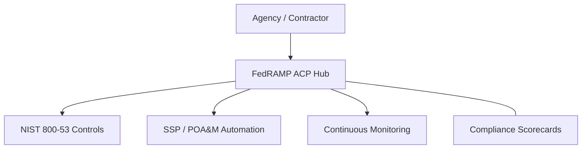

### 2. Detailed Platform Topology
The internal service boundaries and management layers of the industrialized compliance platform.

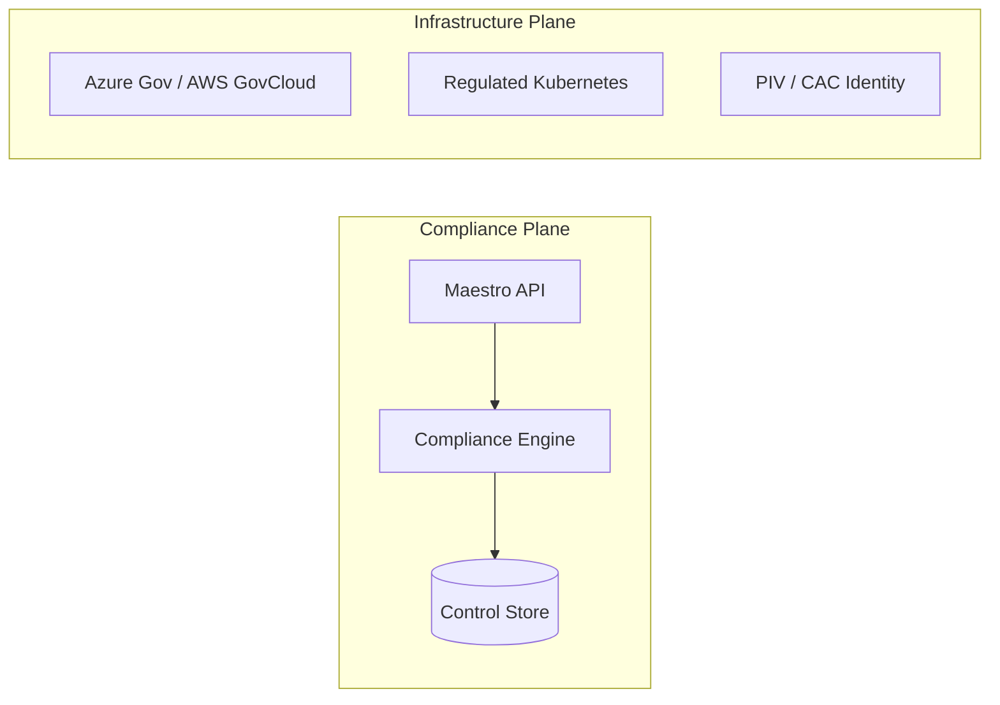

### 3. User to Control Plane Request Path
Tracing the secure path from a compliance officer to a control validation result.

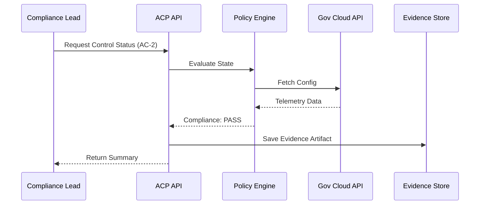

### 4. Compliance Control Plane
The "Brain" of the framework managing global institutional standards and policy-as-code.

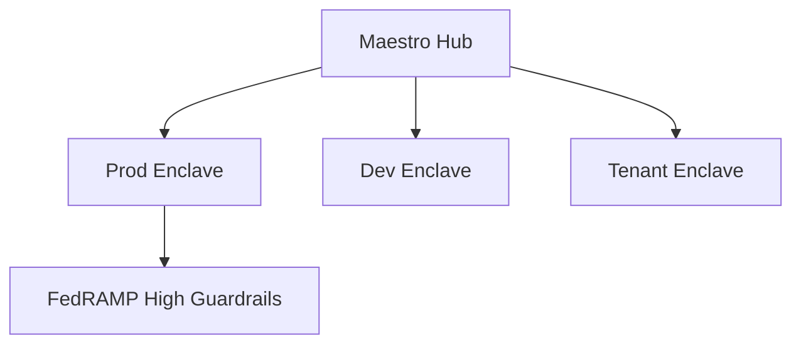

### 5. Multi-Cloud Topology
Synchronizing institutional compliance standards across Azure Government and AWS GovCloud.

```mermaid
graph LR
    Azure[Azure Gov] <-> Bridge[Compliance Sync] <-> AWS[GovCloud]
    Bridge <-> GCP[Assured Workloads]
```

### 6. Regional Deployment Model
Hosting compliance services within sovereign regions for low latency and data residency.

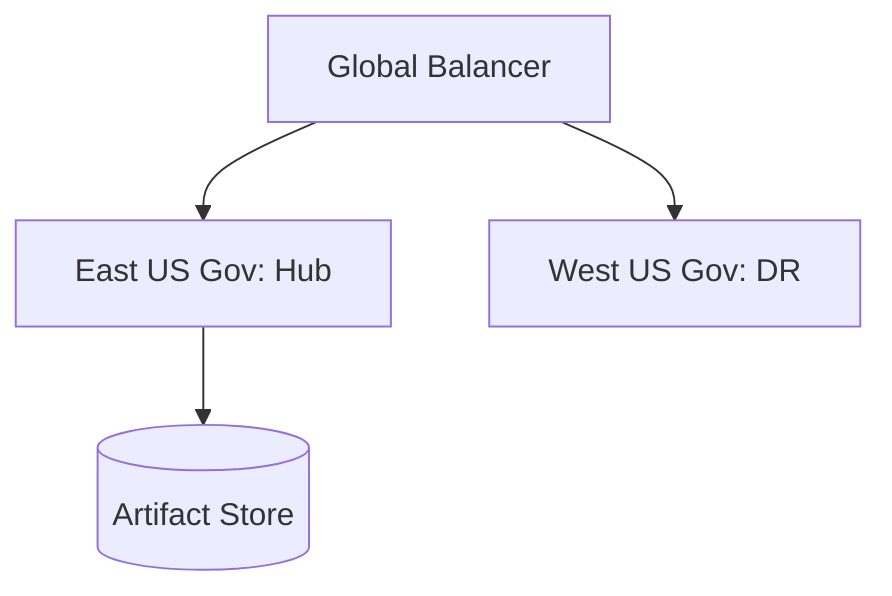

### 7. DR Failover Model
Ensuring platform continuity for critical compliance evidence and POA&M tracking.

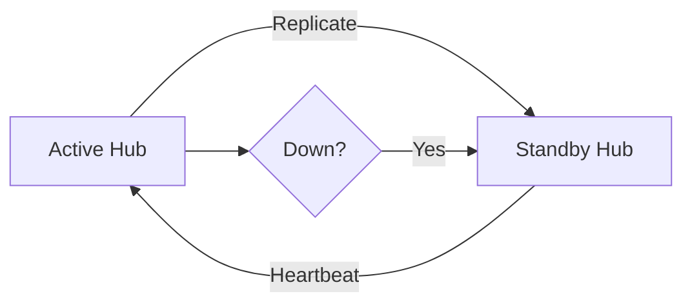

### 8. API Gateway Architecture
Securing and throttling the entry point for compliance orchestration and artifact metadata.

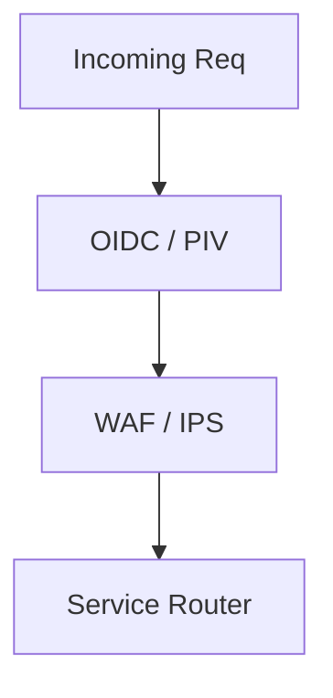

### 9. Queue Worker Architecture
Managing long-running compliance scans, report generation, and evidence sync tasks.

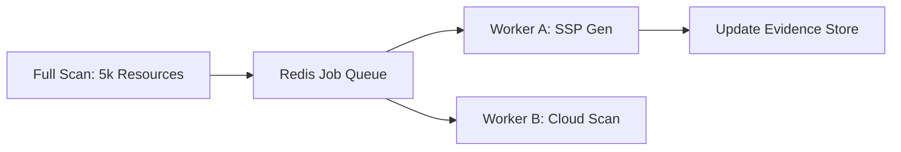

### 10. Dashboard Analytics Flow
How raw compliance telemetry becomes executive institutional readiness scorecards.

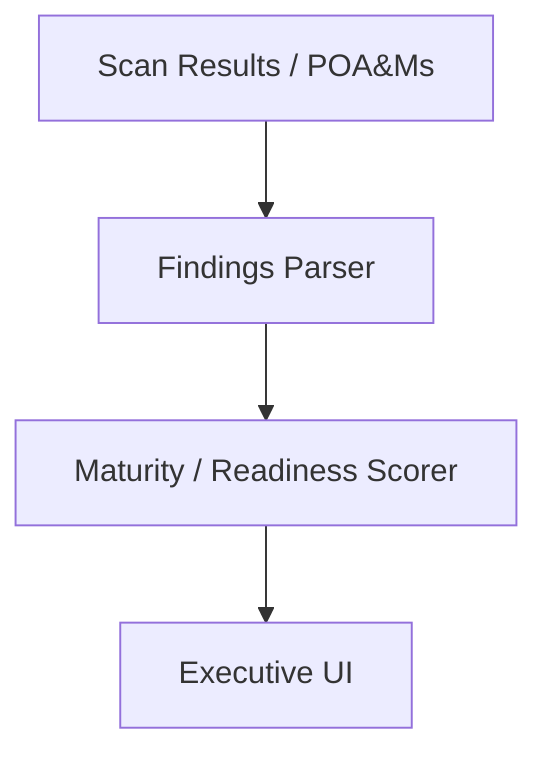

### 11. FedRAMP Moderate Control Model
Visualizing the 325 baseline controls required for Moderate-impact federal workloads.

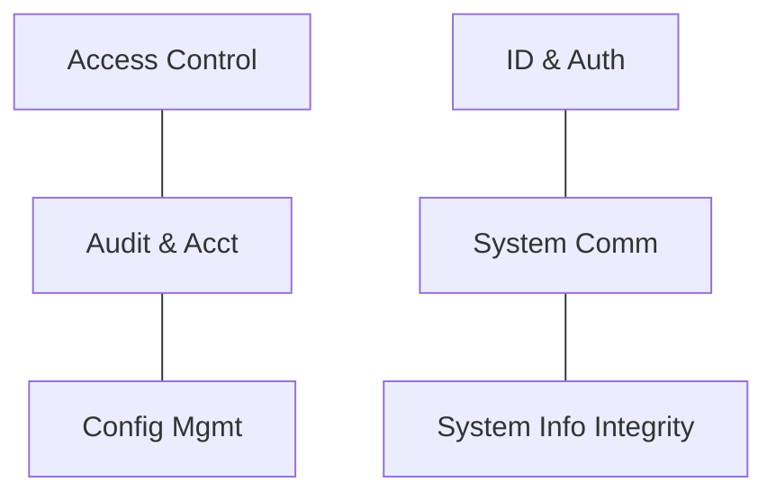

### 12. FedRAMP High Control Model
The expanded 421 control set for systems handling mission-critical or PII/SPI data.

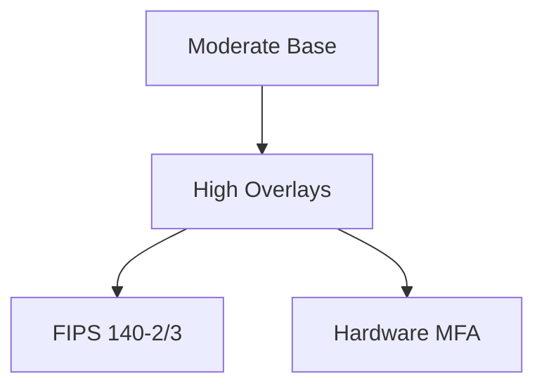

### 13. NIST 800-53 Family Mapping
The taxonomic structure of federal security and privacy controls.

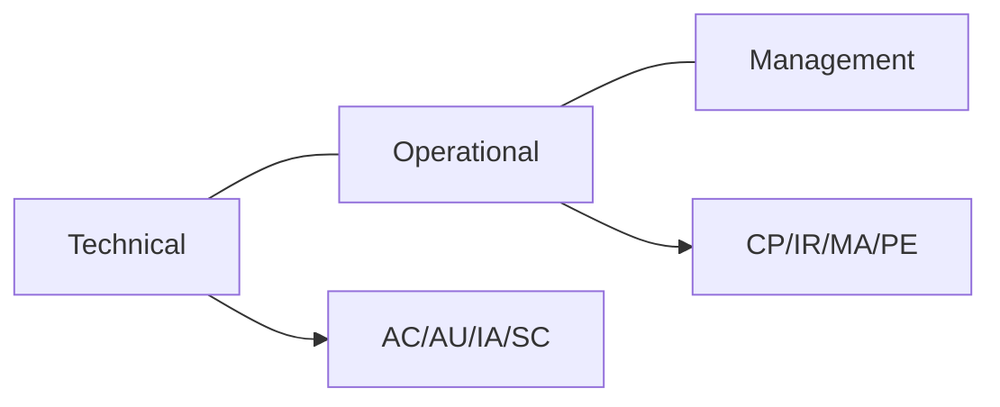

### 14. Shared Responsibility Matrix
Defining the demarcation between the CSP (Cloud Service Provider) and the Customer.

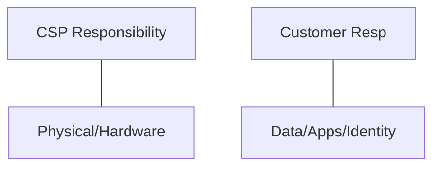

### 15. Inheritance Control Workflow
Leveraging compliance artifacts from underlying authorized platforms (e.g., Azure Gov).

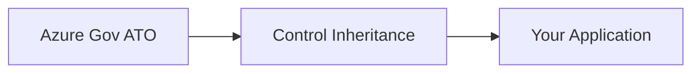

### 16. Customer Responsibility Model
Focusing assessment efforts on the specific controls managed by the agency or tenant.

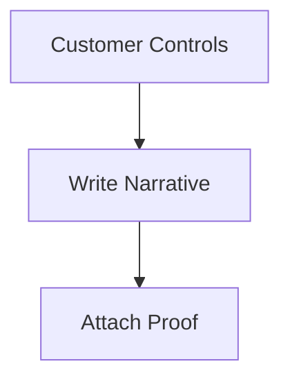

### 17. Overlay Selection Process
Applying specific security requirements based on system sensitivity (e.g., Privacy, IoT).

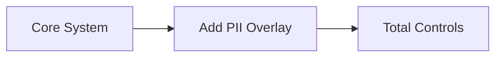

### 18. Tailoring Workflow
Justifying and documenting the removal or modification of baseline controls.

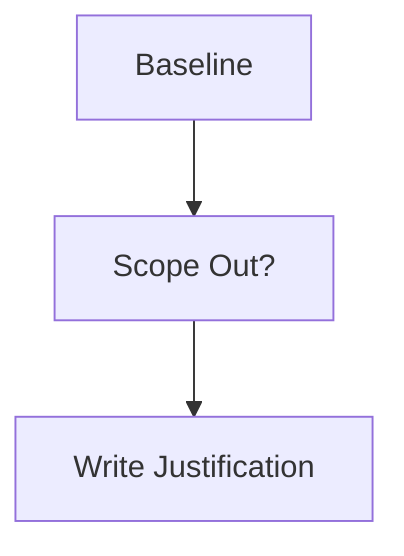

### 19. Assessment lifecycle model
The journey through the 3PAO assessment to a finalized SAR (Security Assessment Report).

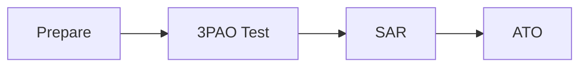

### 20. Authorization Path workflow
The formal agency or JAB (Joint Authorization Board) review and decision cycle.

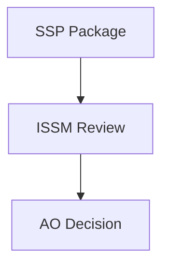

### 21. SSP Data Model
The structured metadata representing the System Security Plan.

```mermaid
graph TD
    SSP[SSP Root] --> Component[Subsystem] --> Control[NIST Control]
```

### 22. Control Narrative Workflow
Collaborative authoring and review of security control implementation statements.

```mermaid
graph LR
    Author[Author] --> Review[QA Review] --> Approval[Finalized]
```

### 23. Evidence Linkage Model
Automatically mapping raw technical proof (logs, configs) to specific NIST controls.

```mermaid
graph TD
    Log[Syslog] --> Evidence[Evidence Obj] --> AC2[AC-2 Control]
```

### 24. Diagram Repository Lifecycle
Managing architecture diagrams as code to ensure SSP-to-Live consistency.

```mermaid
graph LR
    Source[Mermaid/DSL] --> Render[CI/CD] --> SSP[SSP PDF]
```

### 25. Version Control for SSP
Tracking every change to the compliance documentation for audit traceability.

```mermaid
graph TD
    Git[SSP-Repo] --> Commit[Change Note] --> Audit[Traceability]
```

### 26. Stakeholder Approval Workflow
Automated routing of SSP sections to system owners and security leads.

```mermaid
graph LR
    Section[AC Family] --> Owner[System Owner] --> Signed[Approved]
```

### 27. Documentation Traceability Map
Linking requirements to implementation statements to assessment results.

```mermaid
graph TD
    NIST[Requirement] --> SSP[Narrative] --> SAR[Test Result]
```

### 28. Artifact Retention Model
Governing the lifecycle of evidence and audit logs per federal records requirements.

```mermaid
graph LR
    Current[3 Years] --> Archive[7 Years] --> Purge[Delete]
```

### 29. Change Impact to SSP flow
Assessing how infrastructure changes trigger required updates to the compliance package.

```mermaid
graph TD
    Change[New Service] --> Impact[SSP Review] --> Update[Edit SSP]
```

### 30. Continuous Update Lifecycle
The "Living SSP" model where documentation reflects the real-time state of the cloud.

```mermaid
graph LR
    Monitor[Monitor] --> Trigger[Delta Found] --> AutoUpdate[Sync SSP]
```

### 31. POA&M Issue Intake Flow
Capturing vulnerabilities and audit findings into the formal Plan of Action & Milestones.

```mermaid
graph TD
    Find[Finding] --> Intake[ACP API] --> POAM[New Item]
```

### 32. Severity Prioritization Model
Ranking POA&M items based on federal impact levels (High/Moderate/Low).

```mermaid
graph LR
    Critical[CRIT: 30 Days] --- High[HIGH: 90 Days] --- Low[LOW: 365 Days]
```

### 33. Remediation Lifecycle
The path from identified weakness to verified remediation and closure.

```mermaid
graph TD
    Open[Open] --> Fixing[In Progress] --> Verify[Internal Test] --> Closed[Resolved]
```

### 34. SLA Tracking Workflow
Monitoring remediation timelines against federal mandates and institutional SLAs.

```mermaid
graph LR
    Target[90 Days] <-> Actual[45 Days] --> Status[Compliant]
```

### 35. Exception Approval Process
Managing time-bound or permanent deviations from security policy with AO approval.

```mermaid
graph TD
    Req[Req Exception] --> Risk[Risk Analysis] --> AO[Signed Approval]
```

### 36. Risk Acceptance Model
Documenting and justifying the acceptance of residual risks within the system.

```mermaid
graph LR
    Risk[Risk] --> Impact[Business Impact] --> Accept[Signed Waiver]
```

### 37. Escalation Workflow
Notifying leadership when POA&M items approach or exceed federal closure deadlines.

```mermaid
graph TD
    Warning[Due: 5 Days] --> CISO[CISO Alert] --> Breach[SLA Overdue]
```

### 38. Vulnerability to POA&M Mapping
Linking scanner findings (Nessus/Qualys) directly to their parent POA&M entries.

```mermaid
graph TD
    CVE[CVE-2024-X] --> Vuln[Scan Finding] --> POAM[POAM-2024-01]
```

### 39. Executive Risk Heatmap
Visualizing the distribution of system weaknesses by impact and remediation status.

```mermaid
graph TD
    HighRisk[Top Left] <-> LowRisk[Bottom Right]
```

### 40. Closure Validation Flow
Requiring independent verification of evidence before a POA&M can be marked closed.

```mermaid
graph LR
    Remediated[Evidence Upload] --> Validator[Security Scan] --> Closed[Closure]
```

### 41. Commit to Compliance Workflow
The DevSecOps pipeline where code commits trigger automated compliance checks.

```mermaid
graph LR
    Code[git push] --> Scan[ACP Scan] --> Gate[Allow/Deny]
```

### 42. IaC Scanning Pipeline
Validating Terraform and Bicep templates against FedRAMP security baselines.

```mermaid
graph TD
    TF[Terraform] --> OPA[OPA Policy] --> Pass[Compliant]
```

### 43. Container Scan Lifecycle
Ensuring all OCI images meet federal vulnerability and configuration standards.

```mermaid
graph LR
    Build[Build] --> Trivy[Vulnerability Scan] --> Sign[Cosign Sign]
```

### 44. Dependency Scan Model
Monitoring the software supply chain for insecure libraries and licensing risks.

```mermaid
graph TD
    Repo[App] --> Snyk[Scan Deps] --> BOM[SBOM Gen]
```

### 45. Secrets Detection Workflow
Preventing the leakage of keys, certificates, and credentials into code repositories.

```mermaid
graph LR
    Check[Gitleaks] --> Detect[Secret Found] --> Block[Pre-commit Fail]
```

### 46. Policy-as-Code Gate
The final enforcement point in the CI/CD pipeline before infrastructure deployment.

```mermaid
graph TD
    Req[Deploy] --> Policy[Sentinel/Checkov] --> Decision[Approved]
```

### 47. Terraform Provisioning Model
Orchestrating compliant infrastructure through standardized, pre-audited modules.

```mermaid
graph LR
    Code[TF Module] --> Plan[State Review] --> Apply[Secure Infra]
```

### 48. Drift Detection Lifecycle
Continuously comparing the live environment against the authorized "Gold Standard" state.

```mermaid
graph TD
    Live[Cloud State] <-> Code[Git Source] --> Drift[Alert]
```

### 49. Golden Image Pipeline
Automating the creation of CIS-hardened OS images for use across the enterprise.

```mermaid
graph LR
    Raw[Base OS] --> Pack[Packer Build] --> Hardened[Signed Image]
```

### 50. Release Approval Flow
Synchronizing software releases with compliance sign-offs and change management.

```mermaid
graph TD
    Build[Build OK] --> Compliance[Audit OK] --> CAB[CAB Approval]
```

### 51. OIDC / SSO Auth Flow
Enforcing PIV/CAC multi-factor authentication for all platform and cloud access.

```mermaid
graph LR
    User[User] --> Entra[Entra ID Gov] --> Platform[ACP Hub]
```

### 52. RBAC Model
Defining granular roles for Security Leads, System Owners, and Compliance Officers.

```mermaid
graph TD
    Role[Auditor] --> Perm[Read-Only SSP]
```

### 53. Privileged Access Workflow
Governing temporary, just-in-time access for administrative or emergency tasks.

```mermaid
graph LR
    Req[JIT Req] --> Approve[Manager] --> Access[2hr Access]
```

### 54. Key Management Lifecycle
Automating the rotation and protection of encryption keys in FIPS 140-2 modules.

```mermaid
graph TD
    Key[KMS Key] --> Rotate[90 Day Auto] --> Vault[Hardware Vault]
```

### 55. Audit Logging Architecture
The unified path for capturing and protecting federal audit records (AU-6).

```mermaid
graph LR
    Log[Syslog] --> Forwarder[FluentD] --> SIEM[Sentinel]
```

### 56. Metrics Pipeline
Transforming raw compliance telemetry into real-time health and risk metrics.

```mermaid
graph TD
    Raw[Scan Data] --> Prom[Prometheus] --> Graf[Grafana]
```

### 57. Logging Architecture
The multi-layered approach to capturing platform and infrastructure audit trails.

```mermaid
graph LR
    App[App Logs] --- Cloud[Activity Logs] --- Net[NSG Flows]
```

### 58. Tracing Model
Observing security request chains across microservices for troubleshooting (AU-12).

```mermaid
graph TD
    Req[User Req] --> API[Gate] --> DB[Query]
```

### 59. Incident Response Workflow
The automated path from detection to federal reporting (IR-6) and recovery.

```mermaid
graph TD
    Detect[Threat] --> Playbook[Isolation] --> Report[US-CERT]
```

### 60. Continuous Monitoring Cycle
The repeating loop of scan, remediate, and document required by FedRAMP.

```mermaid
graph LR
    Watch[Monitor] --> Analyze[Report] --> Act[Remediate]
```

### 61. Executive KPI Review Cycle
Reporting compliance posture, risk trends, and budget impact to the C-suite.

```mermaid
graph TD
    Stats[Stats] --> Deck[Executive Summary]
```

### 62. ATO Readiness Scorecard
The real-time "Green/Yellow/Red" view of authorization package completeness.

```mermaid
graph LR
    SSP[80%] <-> POAM[0 Critical] <-> Readiness[95%]
```

### 63. POA&M Aging Dashboard
Visualizing the backlog and closure speed of security weaknesses over time.

```mermaid
graph TD
    Days[Days Open] --- Count[Open Items]
```

### 64. Scan Coverage Model
Ensuring 100% of the authorized boundary is being monitored by security tools.

```mermaid
graph LR
    Assets[Inventory] <-> Scanned[Monitor Data]
```

### 65. Team Benchmark Comparison
Comparing the compliance performance and remediation speed of different missions.

```mermaid
graph TD
    TeamA[Fast] <-> TeamB[Lagging]
```

### 66. Quarterly Governance Cadence
The formal rhythm of ConMon reviews and POA&M submissions to the PMO.

```mermaid
graph TD
    M1[Scan] --> M3[Report to PMO]
```

### 67. Board Reporting Model
Communicating compliance risk and strategic investment to non-technical leaders.

```mermaid
graph LR
    Compliance[Compliance] --> Mission[Mission Success]
```

### 68. Vendor Management Workflow
Assessing and governing the supply chain and 3rd party risk (SA-12).

```mermaid
graph TD
    Vendor[New SaaS] --> Audit[Security Review] --> Allow[Connect]
```

### 69. Compliance Maturity Roadmap
The journey from "Manual Compliance" to "AI-Native Continuous Governance."

```mermaid
graph LR
    S1[Excel] --> S5[AI-ACP]
```

### 70. Continuous Improvement Loop
The engine for evolving compliance policies based on new threats and audits.

```mermaid
graph LR
    Audit[Audit Result] --> Policy[Policy Update]
```

### 71. OSCAL Automation Model
Implementing the Open Security Controls Assessment Language for machine-readable docs.

```mermaid
graph LR
    Metadata[JSON/YAML] --> OSCAL[OSCAL SSP] --> Interop[Multi-Tool Sync]
```

### 72. AI Evidence Classification Flow
Using NLP to automatically categorize and link technical logs to NIST controls.

```mermaid
graph TD
    Doc[Log File] --> LLM[Classifier] --> Control[AC-2 Map]
```

### 73. Multi-agency Tenancy Model
Architecting isolated enclaves for multiple government customers on a shared ACP.

```mermaid
graph LR
    Hub[Admin] --> TenantA[Agency 1] --- TenantB[Agency 2]
```

### 74. Sovereign Region Architecture
Deploying compliance controls in regions with restricted access and local residency.

```mermaid
graph TD
    Region[Gov US] --> Lock[Isolated Admin] --> Data[Data Resident]
```

### 75. Cross-domain Enclave Model
Governing secure data transfer between different sensitivity levels (e.g., Unclass to High).

```mermaid
graph LR
    Low[Unclass] --> Diode[Data Diode] --> High[Sensitive]
```

### 76. Zero Trust Government Model
Enforcing identity-based micro-segmentation across the federal backbone.

```mermaid
graph TD
    ID[PIV Identity] --> Context[Location/Device] --> Grant[Access]
```

### 77. Insider Risk Correlation
Monitoring administrator behavior for anomalous patterns that indicate threat.

```mermaid
graph LR
    Act[Log] --> Model[Behavior AI] --> Risk[Alert]
```

### 78. Supply Chain Assurance Model
Verifying the integrity of software artifacts from source to production (SLSA).

```mermaid
graph TD
    Git[Source] --> Sign[Attestation] --> Run[Verified]
```

### 79. Innovation Portfolio Roadmap
Planning the next 36 months of compliance platform evolution and AI integration.

```mermaid
graph TD
    Now[Automation] --> Year3[AI-Autonomy]
```

### 80. Strategic Transformation Timeline
The multi-year mission to modernize compliance across the enterprise estate.

```mermaid
graph LR
    Year1[Foundation] --> Year3[Institutional]
```

### 81. SIEM Integration Workflow
Automating the flow of compliance findings from ACP into the corporate SOC.

```mermaid
graph LR
    Finding[Finding] --> API[Webhook] --> SIEM[Sentinel Alert]
```

### 82. CMDB Sync Lifecycle
Ensuring the compliance asset inventory matches the corporate system of record.

```mermaid
graph TD
    ACP[Compliance Store] <-> CMDB[ServiceNow] --> Sync[Conflict Check]
```

### 83. Backup Recovery Model
Governing the protection and testing of mission-critical compliance data (CP-9).

```mermaid
graph LR
    Active[Live] --> Backup[Immutable Snap] --> Test[Monthly Restore]
```

### 84. Change Management Workflow
Integrating compliance reviews into the standard ITIL change management process.

```mermaid
graph TD
    Change[Change Req] --> Compliance[Risk Impact] --> CAB[Signed]
```

### 85. Tenant Baseline Comparison
Auditing individual tenant configurations against the authorized platform baseline.

```mermaid
graph TD
    Gold[Platform Gold] <-> Tenant[Tenant A]
```

### 86. Patch Compliance Flow
Automating the detection, reporting, and verification of software patches (SI-2).

```mermaid
graph LR
    Scan[Scan] --> Patch[Apply] --> Verify[Re-scan]
```

### 87. Network Segmentation Model
Visualizing the boundaries between management, production, and public zones.

```mermaid
graph TD
    Mgt[Mgt Zone] --- Prod[Prod Zone] --- Ext[Public Zone]
```

### 88. Endpoint Posture Workflow
Validating that all management devices meet federal security standards before access.

```mermaid
graph LR
    Device[Laptop] --> Health[Intune Check] --> Login[Platform Access]
```

### 89. Asset Inventory Lifecycle
The automated discovery and governance of cloud and hybrid resources (CM-8).

```mermaid
graph TD
    Discover[Scan Cloud] --> Inventory[Asset DB] --> Retire[Decomm]
```

### 90. Data Retention Governance
Enforcing institutional policies for data lifecycle and secure deletion.

```mermaid
graph LR
    Active[30 Days] --> Warm[1 Year] --> Cold[7 Years]
```

### 91. API Integration Mesh
The secure fabric connecting ACP to external scanners and ticketing systems.

```mermaid
graph LR
    ACP[Hub] <-> Jira[POAMs] --- Tenable[Vulnerabilities]
```

### 92. Queue Processing Lifecycle
Ensuring high-availability and fault-tolerance for background compliance tasks.

```mermaid
graph TD
    Task[Job] --> Worker[Process] --> Ack[Success]
```

### 93. Cost Allocation Model
Attributing compliance-as-a-service costs to specific agencies and enclaves.

```mermaid
graph LR
    Usage[Storage/Scan] --> Billing[Showback]
```

### 94. Contractor Access Governance
Strictly governing the lifecycle and permissions of external federal contractors.

```mermaid
graph TD
    New[Onboard] --> Audit[Background Check] --> Access[Least Priv]
```

### 95. Global PMO Operating Model
The institutional structure for 24/7 global compliance and authorization operations.

```mermaid
graph LR
    Follow[Follow the Sun] --- PMO[FedRAMP Center]
```

---

## 🔬 Compliance Methodology

### 1. The ACP Pillars
Our platform is built on four core pillars:
- **Automation**: Eliminating manual data entry through machine-readable documentation (OSCAL).
- **Integrity**: Protecting compliance artifacts through immutable storage and hardware MFA.
- **Transparency**: Providing real-time risk visibility to all authorized stakeholders.
- **Efficiency**: Reducing the "Compliance Tax" through reusable controls and inheritance.

### 2. Authorization Strategy
We provide a strategic framework for choosing the right authorization path based on system impact, mission criticality, and budget.

---

## 🚦 Getting Started

### 1. Prerequisites
- **Azure Gov / AWS GovCloud** subscription.
- **Terraform** & **Open Policy Agent** (latest versions).
- **Python** (3.11+) for the compliance engine.

### 2. Local Setup
```bash
# Clone the repository
git clone https://github.com/Devopstrio/fedramp-acp.git
cd fedramp-acp

# Start the Compliance Control Plane
docker-compose up --build
```
Access the Portal at `http://localhost:3000`.

---

## 🛡️ Governance & Security
- **Security by Design**: Deep integration with NIST 800-53 security baselines.
- **Audit Ready**: Built-in evidence generation for FedRAMP and internal audits.
- **Zero Trust**: Enforcing identity-based access and encryption for all compliance data.

---
<sub>&copy; 2026 Devopstrio &mdash; Engineering the Future of Industrialized Federal Compliance.</sub>
