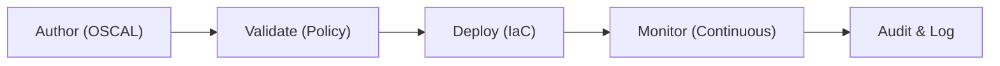
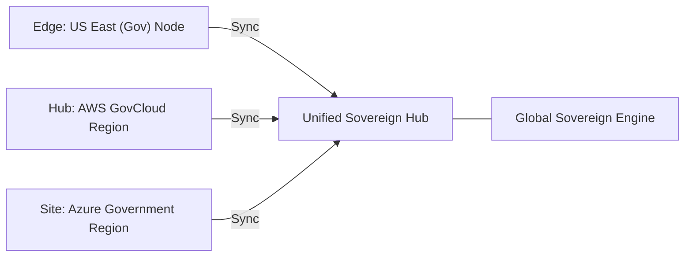
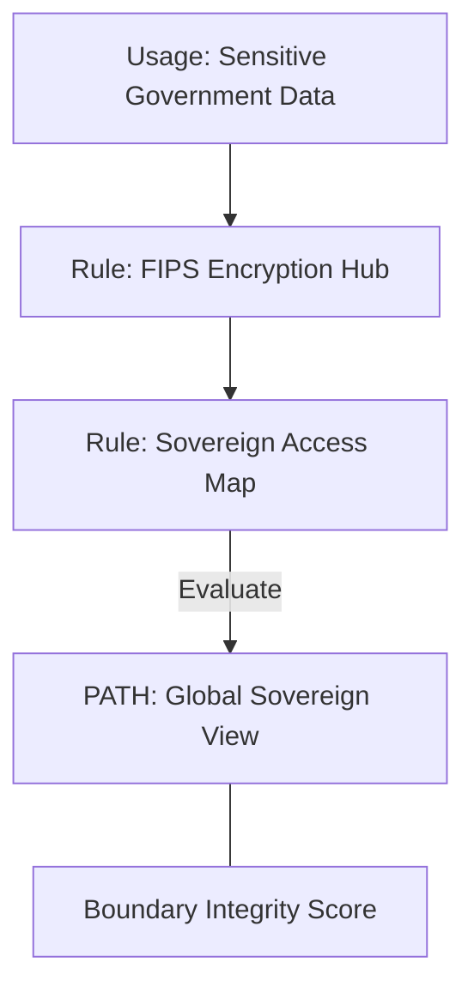
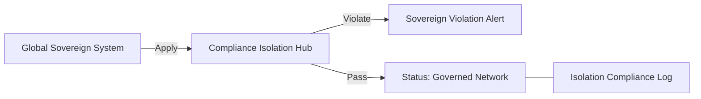
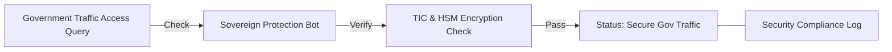
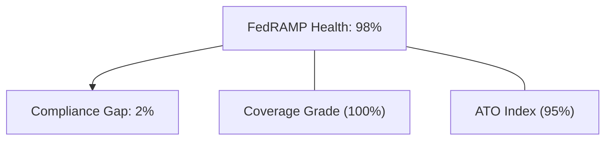
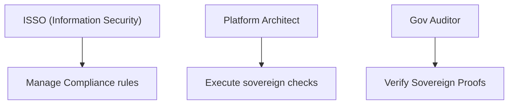
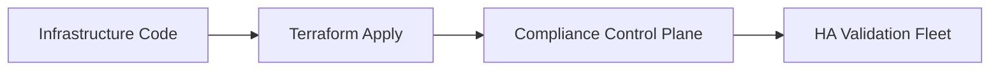
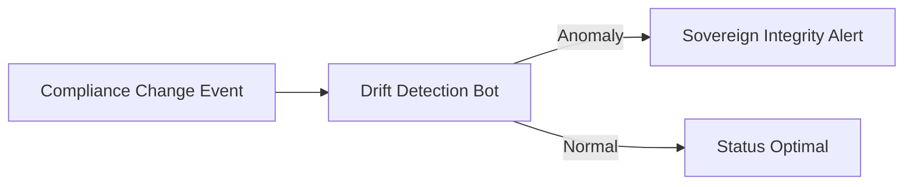
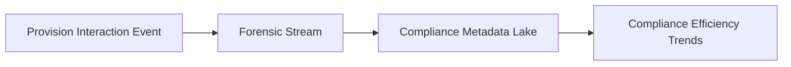

<div align="center">


<h1>FedRAMP Automated Compliance Platform</h1>

<p><strong>The Institutional-Grade Platform for NIST 800-53 Compliance, SSP Automation, and Sovereign Cloud Governance Orchestration.</strong></p>

[]()
[]()
[]()

<br/>

> **"Industrializing federal compliance to automate authorization lifecycles."** 
> **FedRAMP Automated Compliance Platform (ACP)** is an enterprise-grade platform designed to provide a secure, measurable, and highly automated foundation for global government operations. It orchestrates the complex lifecycle of compliance—from OSCAL-driven authoring and policy validation to continuous monitoring and unified forensic auditing.

</div>

---

## 🏛️ Executive Summary

Fragmented compliance silos and manual documentation workflows are strategic operational liabilities; lack of centralized compliance orchestration is a primary barrier to organizational FedRAMP maturity. Organizations fail to maintain a secure sovereign foundation not because of a lack of controls, but because of fragmented compliance standards, lack of automated validation, and an inability to orchestrate compliance planes with operational precision.

This platform provides the **FedRAMP Compliance Intelligence Plane**. It implements a complete **Enterprise FedRAMP-ACP-as-Code Framework**, enabling ISSOs and Platform teams to manage global sovereign foundations as first-class citizens. By automating the identification of regulatory bottlenecks through real-time telemetry analysis and orchestrating the deployment of secure compliance-driven landing zone policies, we ensure that every organizational service—from mission-critical government data to distributed management planes—is governed by default, audited for history, and strictly aligned with institutional federal frameworks.

---

## 📐 Architecture Storytelling: Principal Reference Models

### 1. Principal Architecture: Global FedRAMP Automated Compliance Platform & Intelligence Plane
This diagram illustrates the end-to-end flow from OSCAL-driven authoring and multi-cloud orchestration to continuous monitoring, safety validation, and institutional forensic auditing.


```mermaid
graph LR
    %% Subgraph Definitions
    subgraph ComplianceIngress["OSCAL & Authoring Ingress"]
        direction TB
        Security_Baseline["NIST 800-53 Moderate / High"]
        Control_Narratives["SSP / SAR / POA&M Documents"]
        Agency_Policies["DOD / DHS / GSA Mandates"]
    end

    subgraph IntelligenceEngine["Compliance Intelligence Hub"]
        direction TB
        API["FastAPI Compliance Gateway"]
        PolicyOrchestrator["Global Policy & Guardrail Hub"]
        BoundaryGuard_Hub["Sovereign & Boundary Hub"]
        AIOps_Validator["Violation & Drift Analysis Hub"]
    end

    subgraph OperationsPlane["Distributed Sovereign Cloud Fleet"]
        direction TB
        AzureGovHubs["Managed Azure Gov Hubs"]
        AWSGovHubs["Managed AWS GovCloud Hubs"]
        GCPAssuredHubs["Managed GCP Assured Hubs"]
    end

    subgraph OperationsHub["Institutional Sovereign Hub"]
        direction TB
        Scorecard["FedRAMP Maturity Scorecard"]
        Analytics["Violation Flow & ATO Velocity Stats"]
        Audit["Forensic Compliance Metadata Lake"]
    end

    subgraph DevOps["FedRAMP-ACP-as-Code Framework"]
        direction TB
        TF["Terraform Sovereign Modules"]
        DriftBot["Compliance & Config Drift Validator"]
        ChatOps["Sovereign Operations Hub"]
    end

    %% Flow Arrows
    ComplianceIngress -->|1. Submit Baseline| API
    API -->|2. Orchestrate Guardrail| PolicyOrchestrator
    PolicyOrchestrator -->|3. Apply Sovereign Policy| BoundaryGuard_Hub
    BoundaryGuard_Hub -->|4. Assess Drift| AIOps_Validator
    
    AIOps_Validator -->|5. Execute Provision| OperationsPlane
    OperationsPlane -->|6. Notify Status| ChatOps
    API -->|7. Visualize Health| Scorecard
    
    Scorecard -->|8. Track Maturity| Analytics
    Scorecard -->|9. Record Provision| Audit
    
    TF -->|10. Provision Backbone| IntelligenceEngine
    DriftBot -->|11. Inject Compliance Risk| PolicyOrchestrator
    Audit -->|12. Improve Operations| AzureGovHubs

    %% Styling
    classDef ingress fill:#f5f5f5,stroke:#616161,stroke-width:2px;
    classDef intel fill:#e8eaf6,stroke:#1a237e,stroke-width:2px;
    classDef operations fill:#e1f5fe,stroke:#01579b,stroke-width:2px;
    classDef ops fill:#ede7f6,stroke:#311b92,stroke-width:2px;
    classDef devops fill:#e8f5e9,stroke:#1b5e20,stroke-width:2px;

    class ComplianceIngress ingress;
    class IntelligenceEngine intel;
    class OperationsPlane operations;
    class OperationsHub ops;
    class DevOps devops;
```

### 2. The FedRAMP Compliance Lifecycle Flow
The continuous path of a federal compliance initiative from initial author (OSCAL) and validate (policy) to active deploy (IaC), monitor (continuous), and institutional forensic auditing.


```mermaid
graph LR
    Author["Author (OSCAL)"] --> Validate["Validate (Policy)"]
    Validate --> Deploy["Deploy (IaC)"]
    Deploy --> Monitor["Monitor (Continuous)"]
    Monitor --> Audit["Audit & Log"]
```

### 3. Distributed Sovereign Cloud Topology
Strategically orchestrating FedRAMP-compliant workloads across global regions, high-availability zones, and US Sovereign clouds, providing a unified institutional view of global sovereign health and behavioral readiness.


```mermaid
graph LR
    Regional["Edge: US East (Gov) Node"] -->|Sync| Hub["Unified Sovereign Hub"]
    Cloud["Hub: AWS GovCloud Region"] -->|Sync| Hub
    Sovereign["Site: Azure Government Region"] -->|Sync| Hub
    Hub --- Logic["Global Sovereign Engine"]
```

### 4. FIPS 140-2/3 & High-Trust Data Plane Protection Flow
Executing complex logic for securing the bridge between sensitive government data and management planes, ensuring every organizational identity is verified and every sovereign access is according to institutional standards.


```mermaid
graph TD
    GovData["Usage: Sensitive Government Data"] --> Bridge["Rule: FIPS Encryption Hub"]
    Bridge --> BoundaryMap["Rule: Sovereign Access Map"]
    BoundaryMap -->|Evaluate| Context["PATH: Global Sovereign View"]
    Context --- Estimate["Boundary Integrity Score"]
```

### 5. Multi-Agency FedRAMP Governance & Compliance Flow
Automatically managing unified compliance standards across global government agencies (DOD, DHS, GSA), ensuring institutional data residency and security boundaries by default.


```mermaid
graph LR
    Org["Global Sovereign System"] -->|Apply| Guard["Compliance Isolation Hub"]
    Guard -->|Violate| Alert["Sovereign Violation Alert"]
    Guard -->|Pass| Verify["Status: Governed Network"]
    Verify --- Audit["Isolation Compliance Log"]
```

### 6. Encryption & Boundary Protection Flow (FedRAMP Standard)
Managing the lifecycle of a government traffic request, automatically enforcing institutional HSM-backed encryption and TIC (Trusted Internet Connection) standards as required by security policy, ensuring zero-latency security confidence.


```mermaid
graph LR
    GovTraffic["Government Traffic Access Query"] -->|Check| Gatekeeper["Sovereign Protection Bot"]
    Gatekeeper -->|Verify| TIC["TIC & HSM Encryption Check"]
    TIC -->|Pass| Admit["Status: Secure Gov Traffic"]
    Admit --- Audit["Security Compliance Log"]
```

### 7. Institutional FedRAMP Maturity Scorecard
Grading organizational performance based on key indicators: Control Coverage Grade, Continuous Monitoring Index, and ATO Velocity Index.


```mermaid
graph TD
    Post["FedRAMP Health: 98%"] --> Risk["Compliance Gap: 2%"]
    Post --- C1["Coverage Grade (100%)"]
    Post --- C2["ATO Index (95%)"]
```

### 8. Identity & RBAC for Sovereign Governance
Managing fine-grained access to sovereign hubs, provisioning workers, and audit logs between ISSOs, Platform Architects, and Government Auditors.


```mermaid
graph TD
    ISSO["ISSO (Information Security)"] --> Hub["Manage Compliance rules"]
    Architect["Platform Architect"] --> Exec["Execute sovereign checks"]
    Auditor["Gov Auditor"] --> Audit["Verify Sovereign Proofs"]
```

### 9. IaC Deployment: FedRAMP-ACP-as-Code Framework
Using modular Terraform to deploy and manage the versioned distribution of the compliance tracking hubs, boundary protection workers, and forensic metadata lakes.


```mermaid
graph LR
    HCL["Infrastructure Code"] --> TF["Terraform Apply"]
    TF --> Engine["Compliance Control Plane"]
    Engine --> Clusters["HA Validation Fleet"]
```

### 10. AIOps Compliance Drift & Risk Validation Flow
Using advanced analytics to identify sudden surges in policy violations, unauthorized infrastructure changes, suspicious configuration drifts, or unusual compliance pattern changes that could result in institutional risk.


```mermaid
graph LR
    Drift["Compliance Change Event"] --> Analyzer["Drift Detection Bot"]
    Analyzer -->|Anomaly| Alert["Sovereign Integrity Alert"]
    Analyzer -->|Normal| Pass["Status Optimal"]
```

### 11. Metadata Lake for Forensic FedRAMP Audit
Storing long-term records of every infrastructure change (metadata), every security event recorded, and every authorization milestone for institutional record-keeping, compliance auditing, and post-provisioning forensics.


```mermaid
graph LR
    Provision["Provision Interaction Event"] --> Stream["Forensic Stream"]
    Stream --> Lake["Compliance Metadata Lake"]
    Lake --> Trends["Compliance Efficiency Trends"]
```

---

## 🏛️ Core Governance Pillars

1.  **Unified Foundation Coordination**: Maximizing resilience by centralizing all compliance measurement through a single institutional plane.
2.  **Automated Authorization Provisioning**: Eliminating "manual documentation" scenarios through proactive orchestration and pattern verification.
3.  **Sequential Monitoring Intelligence**: Ensuring zero-interruption operations through dependency-aware monitoring-driven compliance engineering.
4.  **Zero-Trust Sovereign Protection**: Automatically enforcing identity-based access and rule evaluation across all sovereign tiers.
5.  **Autonomous Operations Logic**: Guaranteeing reliability through automated industry-specific sovereign monitoring runbooks.
6.  **Full Compliance Auditability**: Immutable recording of every authorization change and rule provision for institutional forensics.

---

## 🛠️ Technical Stack & Implementation

### Compliance Engine & APIs
*   **Framework**: Python 3.11+ / FastAPI.
*   **Compliance Engine**: Custom Python-based logic for multi-cloud sovereign provisioning and DORA-style ATO metrics.
*   **Integrations**: Native connectors for Azure Gov, AWS GovCloud, and GCP Assured Workloads.
*   **Persistence**: PostgreSQL (Compliance Ledger) and Redis (Live Policy State).
*   **Auth Orchestrator**: Federated OIDC/SAML for least-privilege sovereign management access.

### Governance Dashboard (UI)
*   **Framework**: React 18 / Vite.
*   **Theme**: Dark, Teal, Indigo (Modern high-fidelity sovereign aesthetic).
*   **Visualization**: D3.js for sovereign topologies and Recharts for ATO velocity analytics.

### Infrastructure & DevOps
*   **Runtime**: AWS EKS or Azure Kubernetes Service (AKS) for management plane.
*   **Sovereign Hub**: Managed event sourcing for immutable sovereign security timeline reconstruction.
*   **IaC**: Modular Terraform for deploying the FedRAMP landing zone and validation fleet.

---

## 🏗️ IaC Mapping (Module Structure)

| Module | Purpose | Real Services |
| :--- | :--- | :--- |
| **`infrastructure/compliance_hub`** | Central management plane | EKS, PostgreSQL, Redis |
| **`infrastructure/enforcers`** | Distributed sovereign provisioners | Azure, AWS, GCP APIs |
| **`infrastructure/policy_pipes`** | Policy Ingestion Hubs | Webhooks, Lambda |
| **`infrastructure/auditing`** | Forensic sovereign sinks | S3, Athena, Quicksight |

---

## 🚀 Deployment Guide

### Local Principal Environment
```bash
# Clone the landing zone platform
git clone https://github.com/devopstrio/fedramp-acp.git
cd fedramp-acp

# Configure environment
cp .env.example .env

# Launch the FedRAMP stack
make init

# Trigger a mock baseline update and automated compliance validation simulation
make simulate-compliance
```

Access the Management Portal at `http://localhost:3000`.

---

## 📜 License
Distributed under the MIT License. See `LICENSE` for more information.

---
<div align="center">
  <p>© 2026 Devopstrio. All rights reserved.</p>
</div>
